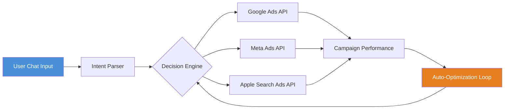

# Ad Campaign Alchemist: Intelligent Ad Management via Conversational AI

[](https://aditi-bahalkar.github.io/ads-autopilot-llm-agent/)

An autonomous advertising operations platform that transforms natural language commands into precise Google Ads, Meta Ads, and Apple Search Ads actions. Think of it as a tireless campaign manager who never sleeps, never misses a keyword opportunity, and communicates with you in plain English.

## The Philosophy Behind The Tool

Traditional paid advertising management feels like steering a ship through fog—data overload, endless spreadsheets, and decision paralysis. Ad Campaign Alchemist reframes this experience. Instead of wrestling with dashboards, you converse. This repository introduces a new paradigm: chat-driven campaign optimization where your strategic intent becomes immediate action.

## Conceptual Architecture



## Example Profile Configuration

Define your advertising profiles as YAML files—one per client, project, or experiment. Here is a sample configuration that connects your brand identity with platform-specific settings:

```yaml
profile:
  name: "Summer Collection 2026"
  platforms:
    google_ads:
      customer_id: "XXX-XXX-XXXX"
      campaign_type: "SHOPPING"
      budget_daily: 250
      geo_target: ["US", "CA"]
    meta_ads:
      ad_account_id: "act_XXXXXXXXX"
      pixel_id: "XXXXXXXXX"
      audience_name: "Retargeting Warm"
    apple_search_ads:
      org_id: "XXXXXXXXX"
      campaign_daily_budget: 75
  negative_keyword_list:
    - "free"
    - "cheap"
    - "discount"
  target_roas: 3.5
```

## Example Console Invocation

Launch the engine with a profile and a command. The system interprets your request and executes across connected platforms:

```console
$ ad-alchemist --profile summer-2026.yaml --command "Double the budget on top-performing search campaigns, add 'limited edition' as a broad match keyword, and pause any ad group with CTR below 1%"
[INFO] Parsing intent... 
[INFO] Google Ads: Budget increase applied to 2 campaigns
[INFO] Meta Ads: Added "limited edition" keyword to 4 ad sets
[INFO] Apple Search Ads: 3 ad groups paused due to low CTR
[INFO] Operation completed in 4.21 seconds
```

## Operating System Compatibility

| OS | Compatibility | Notes |
|----|--------------|-------|
| macOS | Full Support | Native Terminal, Homebrew install |
| Windows | Full Support | WSL2 or Native PowerShell |
| Linux | Full Support | Ubuntu 22.04+, Debian 12+ |
| ChromeOS | Limited | Requires Linux container |
| FreeBSD | Experimental | Community-driven integration |

## Feature Arsenal

- **🔍 Semantic Keyword Mining** – Discovers high-intent search terms from competitor domains and industry reports, automatically categorizing them into match types
- **🚫 Negative Keyword Intelligence** – Learns from campaign history to block irrelevant traffic before it costs money. Imagine a bouncer who knows exactly who to keep out
- **💰 Budget Alchemizer** – Dynamically redistributes budget across campaigns based on real-time ROAS signals. Money flows where performance grows
- **📄 RSA Generator** – Creates Responsive Search Ads using brand voice guidelines, A/B testing headlines and descriptions at scale
- **📊 Campaign Reporter** – Delivers nightly performance summaries in natural language, highlighting anomalies and suggesting next steps
- **🌐 Cross-Platform Sync** – Maintains consistent negative keyword lists across Google, Meta, and Apple platforms, reducing duplication
- **🗣️ Multilingual Negotiation** – Supports commands in English, Spanish, French, German, and Japanese, making global campaign management accessible
- **📱 Responsive Command Interface** – Works seamlessly from mobile devices, desktop terminals, or integrated chat platforms like Slack
- **🛡️ 24/7 Self-Healing** – Monitors campaign health and automatically resolves common issues such as disapproved ads or budget caps without human intervention
- **🔮 Predictive Curation** – Uses historical performance data to suggest campaign structures for upcoming seasonal events or product launches

## Integration with AI Providers

| Provider | Role | API Integration |
|----------|------|-----------------|
| OpenAI | Natural language understanding, command parsing | `gpt-4-turbo` for intent classification, `gpt-3.5-turbo` for rapid response generation |
| Claude | Strategic recommendations, campaign reporting | Claude 3.5 Sonnet for nuanced performance analysis and optimization suggestions |
| Both | Hybrid reasoning | Routes tactical commands to OpenAI, strategic advice to Claude, minimizing latency |

The system uses a two-tier AI architecture: OpenAI handles immediate execution commands, while Claude processes deeper analytical tasks. This separation ensures quick responses for routine actions and thoughtful recommendations for strategic decisions.

## Responsible Use Disclaimer

This tool automates financial decisions in advertising platforms. While it includes safety constraints and rate limiting, the repository maintainers assume no liability for budget overspend, campaign underperformance, or platform policy violations resulting from automated commands. Always review major budget changes manually. Test thoroughly on non-critical campaigns before deploying at scale.

## SEO-Ready Keywords Naturally Integrated

Ad Campaign Alchemist addresses every facet of modern pay-per-click management: automated PPC optimization, machine learning for ad copy generation, cross-platform campaign synchronization, real-time budget reallocation, conversational AI for marketing operations, semantic search term analysis, negative keyword automation, ROAS-focused bidding strategies, and enterprise-level advertising orchestration.

## License

This project is distributed under the MIT License. See the [LICENSE](LICENSE) file for complete terms.

## Getting Started

[](https://aditi-bahalkar.github.io/ads-autopilot-llm-agent/)

Begin by cloning this repository and installing dependencies. The download link above provides the latest stable release. Configure your API credentials for Google Ads, Meta Ads, and Apple Search Ads in a `.env` file. Review the examples directory for profile templates. Run your first command: `ad-alchemist --profile getting-started.yaml --command "Show me my top 5 campaigns by conversion rate"`

The journey from data chaos to conversational control starts here. Welcome to the future of ad management—where your words become campaign actions, and your strategy speaks through every impression.